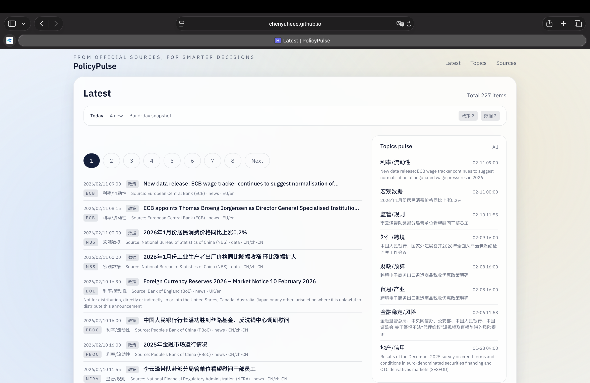
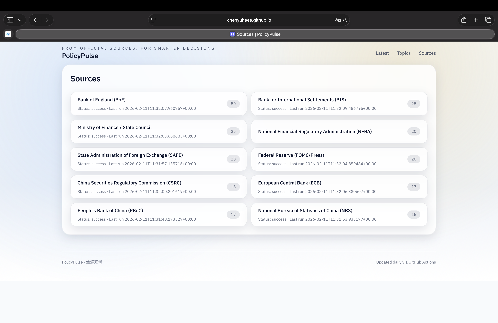
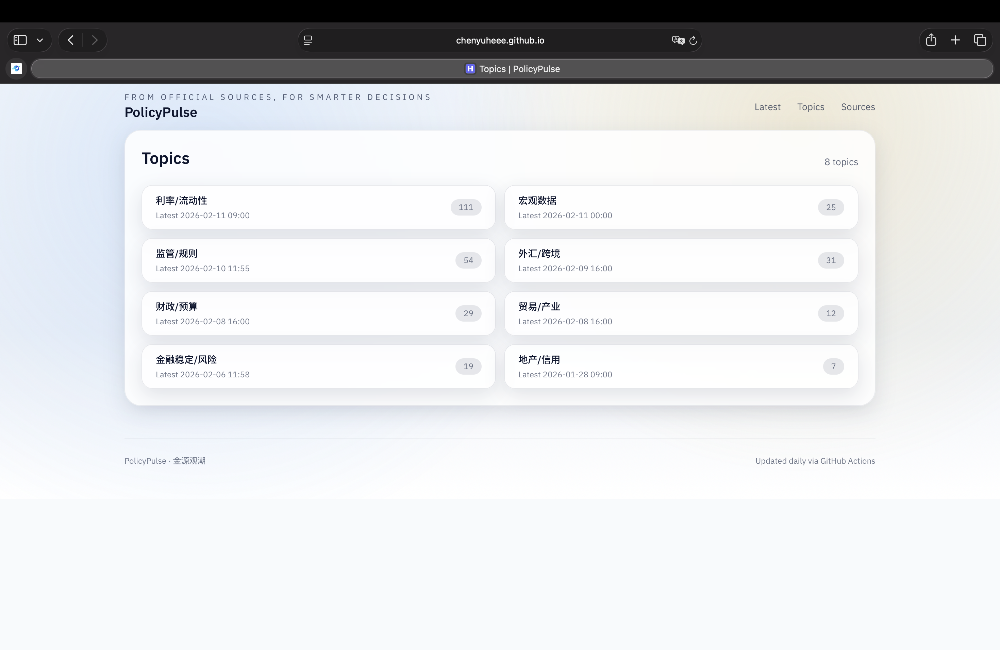
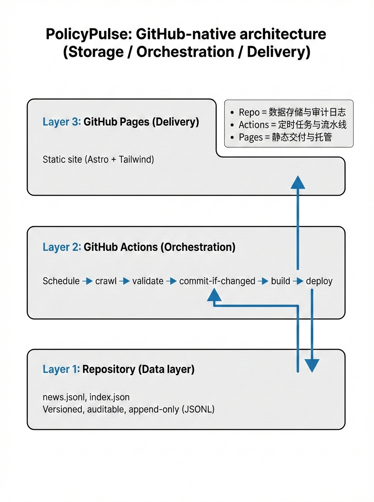
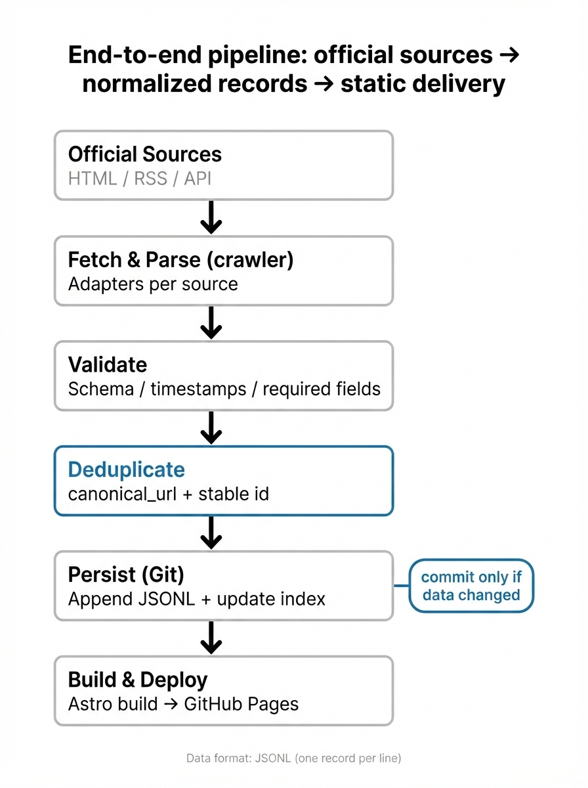
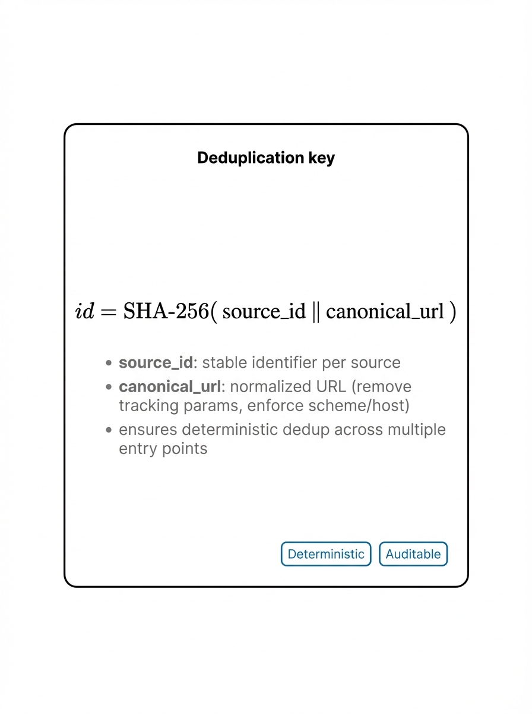

# 小红书推文｜PolicyPulse（金源观潮）：一个 GitHub 原生的“官方政策信息流”

## 1）标题备选（更像小红书一点，选 1 个）

- PolicyPulse：用 GitHub 原生方式做“官方政策信息流”
- 不上服务器、不用数据库：一个低运维信息站的工程实现
- GitHub = 数据层，Actions = 调度层，Pages = 交付层（架构拆解）
- 官方源太分散？我做了一个可追溯的信息聚合站（开源）
- 从抓取到发布：PolicyPulse 的流水线（抓取/校验/去重/构建/部署）

## 2）封面文案备选（放图上）

- PolicyPulse｜政策与宏观信息聚合
- 计算机 × 金融：把官方源做成可追溯信息流
- GitHub 原生：Actions 定时抓取 + Pages 托管
- 抓取 → 校验 → 去重 → 构建 → 发布

## 3）正文（可直接粘贴发布）

我不做观点输出，只做一件事：把官方一手信息整理成**可追溯的信息流**。

难点不在信息量，而在工程层面：**分散、入口深、格式异构、更新频繁**。

所以我做了：**PolicyPulse（中文名：金源观潮）**。

我个人更偏好用工程化的方式解决“信息获取”这种长期问题：可复现、可追溯、低运维。

项目从一开始就设了 3 个约束（避免做成无底洞）：

1) 不买服务器
2) 不建数据库
3) 不写复杂后端

约束带来的好处：架构足够简单，能长期稳定跑。

在线预览： https://chenyuheee.github.io/PolicyPulse/

【配图位 1｜成品截图】

备注：这张目前是横屏截图（2940×1912），建议裁成 3:4 竖图再发（或与配图位 2 做成拼图竖版）。

它做的事不复杂：把分散的官方源，整理成一个可追溯的信息流。

- 你打开就是最新的
- 你能按来源追踪
- 你能按议题聚合

页面结构很克制，只有 3 个入口：

- **Latest**：按时间线看所有最新条目
- **Sources**：按来源看（人行/外汇局/证监会/美联储/ECB/BoE/BIS…）
- **Topics**：按议题聚合（宏观、利率、外汇、财政、监管等）

【配图位 2｜三页结构截图】

（可选）Latest / 首页截图也可作为第三张：

备注：三张均为横屏（2940×1912）。小红书更建议 3:4 竖图：可以把每张裁成同宽竖版，或三张拼成一张竖向长图。

（注：只做信息聚合与索引展示，不做观点输出；不构成任何投资建议/交易建议。）

---

## 4）架构我怎么设计的？（保证一般读者也能看懂）

先给一个“对照表”（把抽象名词翻译成工程组件）：

- 数据库/存储层 → GitHub 仓库（数据文件直接 commit，天然可追溯）
- 调度/计算层 → GitHub Actions（定时运行抓取与构建）
- 交付/托管层 → GitHub Pages（静态站部署即访问）

【配图位 3｜三层对照表（自绘）】

备注：尺寸为 896×1200（接近 3:4）。发布前建议导出到 1080×1440 或 2160×2880，避免小红书二次压缩后字体发糊。

先给一句“人话版总览”，你就能把整个系统看穿：

> 我把 GitHub 当作“存档与发布平台”：仓库里存数据（像数据库），Actions 负责每天更新（像定时任务），Pages 负责把它变成网站（像服务器）。

系统拆成 3 层 + 1 条流水线：

① 抓取层 `crawler/`（把“官网更新”变成结构化数据）
② 数据层 `data/`（把结构化数据放进仓库里，形成可追溯的“历史记录”）
③ 展示层 `site/`（把数据做成网页：按时间/来源/议题浏览）
④ 自动化流水线（Actions 串起来：定时跑、只在有变化时更新、自动部署）

一条线概括数据流：

`官方站点（HTML/RSS/API） → crawler 抓取/解析 → validate 校验 → data/news.jsonl 落盘 → Astro 构建 → GitHub Pages 发布`

【配图位 4｜流水线图（自绘）】

备注：同配图位 3，建议导出更高分辨率版本。

### 4.1 抓取层：怎么做到“加一个源不崩全局”？

我把“新闻源”做成可插拔的：

- 每个来源一份实现：`crawler/sources/`
- 运行时开关与参数：`crawler/sources_config.yaml`（启用/禁用、入口 URL、选择器、API 端点等）

所以新增一个来源的步骤很明确：

1) 写一个 source（适配 HTML/RSS/API 其中一种）
2) 配置文件里打开 `enabled: true`

### 4.2 数据层：为什么不用数据库？

因为我把“增量追加 + 去重”设计好了。

- 数据格式用 **JSONL**：`data/news.jsonl` 一行一条记录，追加写最方便
- 每条记录都有稳定的 `id`：用 `sha256(source_id + canonical_url)` 来去重
- 再生成 `data/index.json`：给前端快速加载用

好处：

- 任何一天的数据更新都能在 GitHub 里被追踪（像记账一样）
- 站点部署是纯静态，成本低，坏了也容易恢复

你可能会问：把数据 commit 到仓库里是不是“非主流”？

我的判断：这不是高并发业务系统，而是“可追溯的信息存档”。

- 今天新增了哪些条目，Git 记录得明明白白
- 想回溯某天的历史，只要看提交历史就行
- 迁移成本很低：仓库搬走，站就跟着走

### 4.3 自动化：它每天到底“怎么自己跑起来”？

默认每天跑一次（也可以手动触发），步骤是：

1) `crawl` 抓取
2) `validate` 校验 + 去重
3) **只有 `data/` 真的变了才 commit**（不制造垃圾提交）
4) 构建静态站
5) 部署到 GitHub Pages

关键是第 3 步：**只在数据有变化时提交**。它让自动化“安静且可靠”，不会每天制造噪音。

【配图位 5｜自动化证据（截图）】

- 放什么：GitHub Actions 一次成功运行截图（能看到步骤列表更好）
- 目的：证明它能长期跑，不靠手动

---

## 5）我觉得最有“产品感”的 3 个点

1) **时间线**：把“更新”变成可浏览的序列
2) **可追溯**：来源明确，链接与发布时间可核验
3) **低运维**：不依赖服务器与数据库，但仍然可扩展新增来源

一句话总结我的偏好：

> 目标不是炫技，是长期主义：我不盯着它，它也能自己更新。

---

## 6）踩坑但关键的 3 件事

- **canonical URL 很关键**：同一条内容经常有多个入口，不规范化就会重复爆炸
- **发布时间不可靠**：有的官网不提供标准时间，只能从列表页/正文结构推断，需要回退策略
- **礼貌抓取与合规**：限速、清晰的 User-Agent；部分 API 需要 Key（可用 GitHub Secrets 配置）

最容易低估的是“重复”：同一条内容多个入口很常见。把 `canonical_url` 规范化 + `id` 稳定性放到第一优先级后，才真正稳定。

【配图位 6｜去重方法（自绘/示例截图）】

备注：同配图位 3，建议导出更高分辨率版本。

---

## 7）如果你也想本地跑一下（两分钟）

- 抓取与校验：
  - `python -m crawler crawl`
  - `python -m crawler validate`
- 前端站点：
  - `cd site && npm install && npm run dev`

---

## 8）最后：我更在意使用反馈

如果你也关注宏观与政策信息，欢迎来用：

- 网站： https://chenyuheee.github.io/PolicyPulse/

我现在更缺的是“真实使用场景的反馈”，而不是功能清单。

也欢迎你给我提建议（这两题对我很重要）：

- 你最希望我优先接入哪个“官方源”？
- 你更想按“来源”看，还是按“议题”看？

（如果你愿意点个 Star 或提 PR，也很受用：README 里有完整说明。）

---

## 9）话题标签建议（小红书）

#效率工具 #信息聚合 #宏观经济 #金融政策 #Python爬虫 #GitHubActions #Astro #静态网站 #开源项目 #个人开发

## 10）配图建议（按正文配图位顺序）

- 配图位 1：`img/主页截图.png`（建议裁成 3:4 竖图）
- 配图位 2：`img/来源截图.png` + `img/topics截图.png` +（可选）`img/主页截图.png`（建议拼成竖向长图或分别裁竖图）
- 配图位 3：`img/配图3.png`（建议导出 1080×1440 或 2160×2880）
- 配图位 4：`img/配图4.png`（建议导出 1080×1440 或 2160×2880）
- 配图位 5：Actions 成功运行截图（你还没放进仓库的话，建议命名 `img/actions截图.png`）
- 配图位 6（可选）：`img/配图6.png`（建议导出 1080×1440 或 2160×2880）
